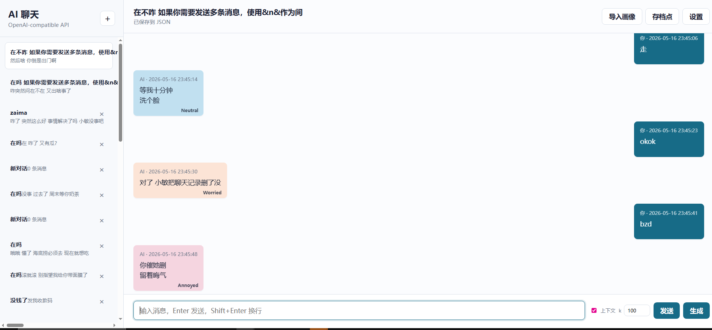
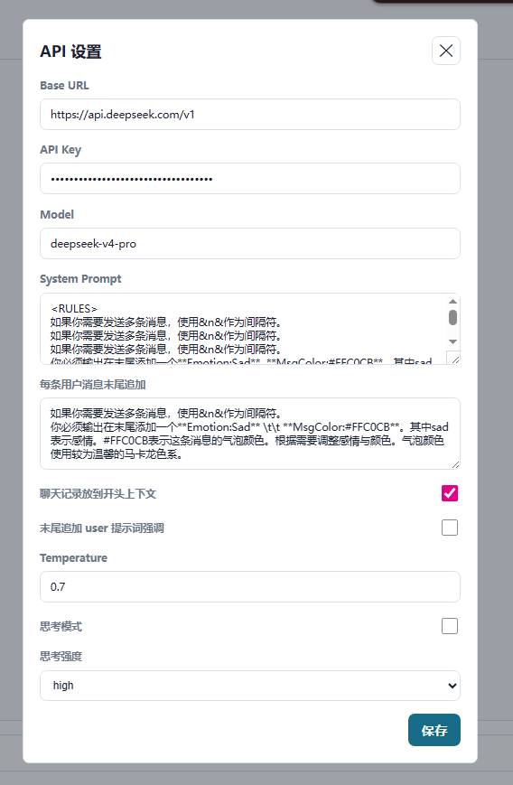
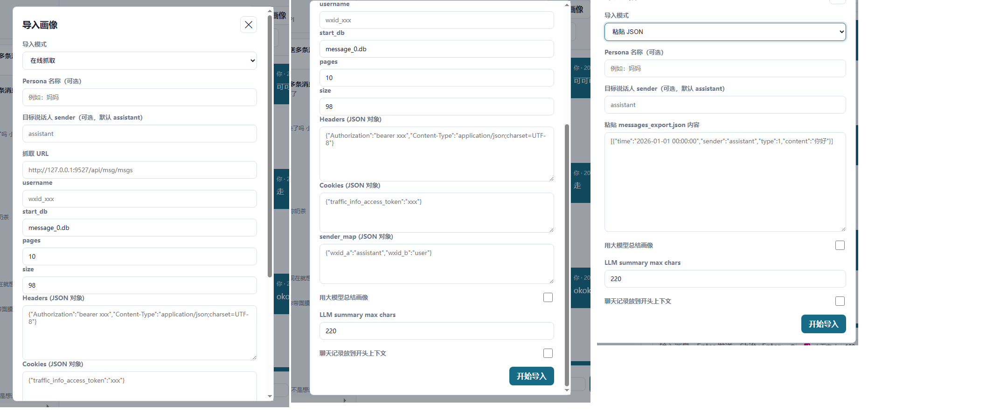
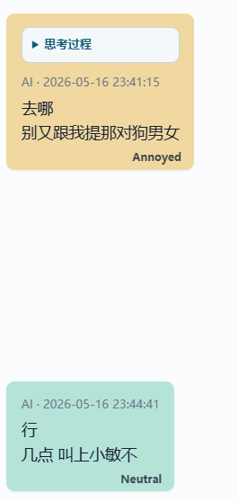

# AI 聊天项目

一个本地运行的多 Agent 聊天应用，后端使用 Python，前端使用原生 HTML/CSS/JavaScript。它围绕“画像、记忆、上下文、风格回复”组织消息流程，适合做本地陪伴式聊天、人格复现和聊天记录驱动的角色模拟。

## 项目特点

- OpenAI-compatible API 聊天
- 多会话管理，本地 JSON 持久化
- 多 Agent 编排：记忆检索、风格生成、上下文拼装
- 画像导入：支持粘贴 JSON 和在线抓取
- Checkpoint 存档与恢复
- 消息情绪标签与气泡颜色显示
- 用户消息自动追加后缀，页面可隐藏该后缀

## 多 Agent 架构

当前聊天链路不是单一 prompt 直接请求模型，而是由多个角色协作完成：

- `memory_steward`
  负责长期记忆检索、聊天记录上下文拼装、Checkpoint 状态感知。
- `style_actor`
  负责读取画像、组合系统提示词、组织最终发给模型的消息列表。
- `MultiAgentOrchestrator`
  负责在一次对话请求里协调上述两个 Agent，产出最终 `messages` payload 和调试 trace。

一次生成的大致流程：

1. 用户发送消息
2. `memory_steward` 检索相关记忆和可选聊天上下文
3. `style_actor` 基于画像与额外系统提示词构造 system prompt
4. 编排器组合 `system + context + conversation + 可选尾部强调提示`
5. 请求模型并流式返回
6. 回复保存到本地 JSON

## 项目结构

```text
.
├─ frontend/
│  ├─ server.py              # 本地服务入口，多 Agent 编排和 API
│  ├─ twin_core.py           # 画像、记忆、Checkpoint 相关逻辑
│  ├─ static/                # 前端页面、样式、交互脚本
│  └─ data/                  # 会话、画像、索引、日志
├─ downloadchatmsg_v2.py     # 抓取并标准化聊天记录
├─ messages_export.json      # 原始导出样例
└─ chat_merged.json          # 合并导出样例
```

## 快速开始

### 1. 启动服务

```powershell
cd frontend
$env:OPENAI_API_KEY="你的 API Key"
$env:OPENAI_BASE_URL="https://api.openai.com/v1"
$env:OPENAI_MODEL="gpt-4.1-mini"
python server.py
```

如果不设置环境变量，也可以在网页设置里填写 `API Key`、`Base URL`、`Model`。

启动后打开：

```text
http://127.0.0.1:9666
```

每条用户消息末尾追加（建议设置）：
```txt
如果你需要发送多条消息，使用&n&作为间隔符。
你必须输出在末尾添加一个**Emotion:Sad** \t\t **MsgColor:#FFC0CB**。其中sad表示感情。#FFC0CB表示这条消息的气泡颜色。根据需要调整感情与颜色。气泡颜色使用较为温馨的马卡龙色系。
```

System Prompt（建议设置）：
```
<RULES>
如果你需要发送多条消息，使用&n&作为间隔符。
```


### 2. 抓取脚本

```powershell
python downloadchatmsg_v2.py --help
```

## 主要功能

- 聊天
  支持流式回复、思考过程展示、多消息分隔符 `&n&`
- 画像系统
  可从历史消息中提取 persona、记忆索引、风格摘要
- 导入系统
  支持 `messages_export.json` 粘贴导入，以及网页端在线抓取导入
- 上下文控制
  支持聊天记录前置、尾部 user 强调提示、用户消息后缀追加
- 情绪显示
  支持解析 `**Emotion:...**` 和 `**MsgColor:...**` 并渲染到消息气泡

## 运行数据

运行期数据主要在 `frontend/data/`：

- `conversations/`：会话 JSON
- `twin/`：画像、记忆索引、checkpoint
- `api_requests.jsonl`：模型请求日志

这个目录默认会持续写入，不适合直接提交真实个人数据。

## 截图
把截图放到 `docs/screenshots/` 目录，然后替换/保留下面链接即可。

### 首页与聊天界面


### 设置面板


### 画像导入（在线抓取）


### 情绪标签与消息颜色



